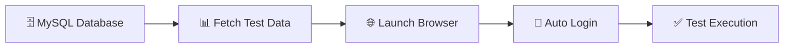

# 🧪 QA Database Testing Framework

> A modern data-driven testing framework combining JDBC and Selenium for seamless test automation

[](https://www.oracle.com/java/)
[](https://www.mysql.com/)
[](https://selenium.dev/)
[](https://maven.apache.org/)

## ✨ Features

- 🗄️ **Database-Driven Testing** - Fetch test data directly from MySQL
- 🤖 **Selenium Automation** - Automated web testing with Chrome WebDriver
- 📊 **Data Management** - Centralized test data storage and retrieval
- 🔄 **Scenario-Based Testing** - Filter test cases by scenario types

## 🛠️ Tech Stack

| Technology | Purpose |
|------------|---------|
| ☕ Java | Core programming language |
| 🗃️ MySQL | Test data storage |
| 🌐 Selenium WebDriver | Browser automation |
| 🔗 JDBC | Database connectivity |
| 📦 Maven | Dependency management |

## 🚀 Quick Start

### Prerequisites

- ☕ Java 17+ installed
- 🗃️ MySQL Server running
- 🌐 ChromeDriver in PATH
- 📦 Maven 3.6+

### 📋 Database Setup

```sql
CREATE DATABASE qa_dbt;
USE qa_dbt;

CREATE TABLE credit_card_users (
    id INT AUTO_INCREMENT PRIMARY KEY,
    username VARCHAR(255),
    password VARCHAR(255),
    scenario VARCHAR(100)
);

INSERT INTO credit_card_users (scenario,username, password, ) 
VALUES ('Login','test@example.com', 'password123');
```

### 🏃‍♂️ Running Tests

```bash
# Clone the repository
git clone <your-repo-url>
cd QA-DB-Testing

# Install dependencies
mvn clean install

# Run the application
mvn exec:java -Dexec.mainClass="com.example.JDBC_Connection"
```

## ⚙️ Configuration

Update your database connection in `JDBC_Connection.java`:

```java
String host = "localhost";
String port = "3306";
String database = "qa_dbt";
String username = "your_username";
String password = "your_password";
```

## 🔄 How It Works



1. 🔌 Connects to MySQL database
2. 📋 Retrieves test credentials by scenario
3. 🚀 Launches Chrome browser
4. 🌐 Navigates to target application
5. 🔐 Performs automated login
6. ✅ Executes test scenarios

## 📁 Project Structure

```
QA-DB-Testing/
├── 📄 pom.xml
├── 📖 README.md
└── src/
    └── main/
        └── java/
            └── com/
                └── example/
                    └── 🧪 JDBC_Connection.java
```


## 🙏 Acknowledgments

- 🎓 Built for learning database-driven testing concepts
- 🌟 Inspired by modern QA automation practices
- 💡 Perfect for beginners exploring test automation

---

<div align="center">
  <b>⭐ Star this repo if you found it helpful!</b>
</div>